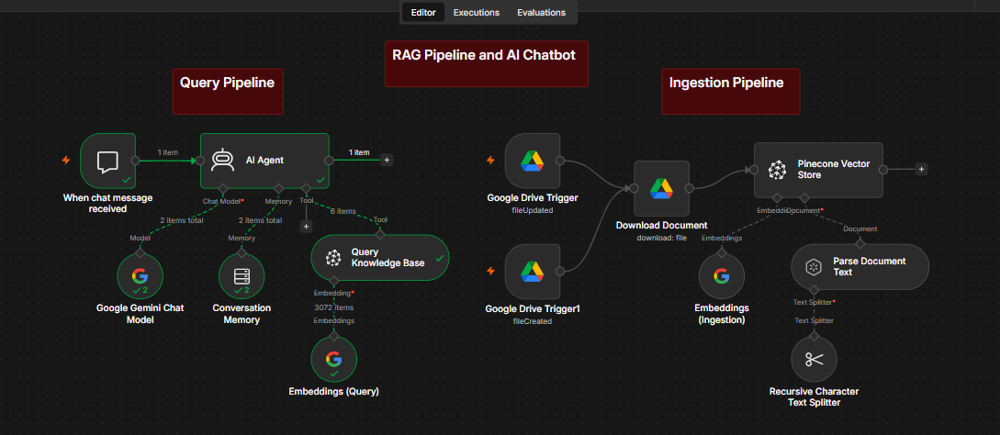
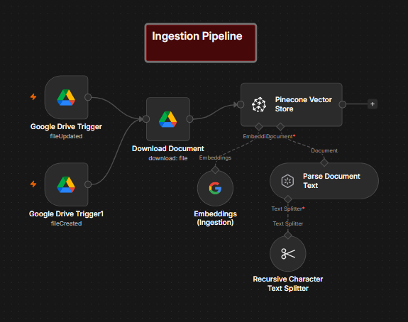
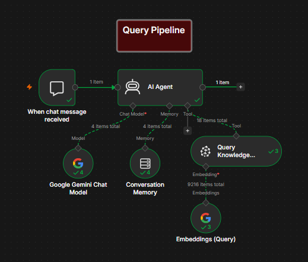

# RAG Pipeline & AI Chatbot

A retrieval augmented generation (RAG) system built entirely in n8n. It watches a Google Drive folder, automatically ingests any new or updated document, and lets you chat with an AI agent that answers questions grounded strictly in that knowledge base.

The demo persona is Nova, an internal assistant for a fictional company called NovaBridge Technologies, built to answer questions from an employee handbook, internal policies, and an FAQ document.

## Key Feature: Live Knowledge Base Updates

The knowledge base isn't static. New documents dropped into the watched Drive folder are automatically chunked, embedded, and indexed, with no manual re run required. The two demos below show this in practice: a document is indexed and queried first, then a second document is added afterward, and the chatbot correctly answers a question that only the new document could answer.

## Tech Stack

| Component | Tool |
|---|---|
| Orchestration | n8n (self hosted) |
| Document source | Google Drive |
| Chunking | Recursive Character Text Splitter |
| Embeddings | Google Gemini |
| Vector store | Pinecone |
| Chat model | Google Gemini/3.5-flash |
| Agent framework | n8n AI Agent (tool calling) |

The full workflow, exported directly from n8n with all credentials removed, is available at [`rag_pipeline.json`](workflow/rag_pipeline.json). It can be imported into any n8n instance to inspect or run the pipeline directly.

## Ingestion Pipeline



This half of the workflow runs independently of the chat and handles getting documents into the knowledge base.

Two Google Drive Trigger nodes watch the same folder, one set to fire on file created, the other on file updated. Using both was actually a fix for a real problem: Google Drive's change detection turned out to be unreliable with just one event type, so a second trigger covering the other case made ingestion consistent.

Once a file change is detected, the document is downloaded and parsed, then split into chunks of 1000 characters with no overlap. Each chunk is embedded using Gemini and stored in a Pinecone index. Both source documents live in the same namespace, so the chatbot can pull from either one without needing to know which document an answer came from.

**Demo: automatic ingestion**


Full video: `media/demo_videos/demo_1.mp4`

## Query Pipeline



This half handles the actual chat experience.

When a message comes in, the AI Agent checks conversation memory for context, then decides whether it needs to look something up. If it does, it calls the Pinecone retrieval tool, which searches the shared namespace and returns the most relevant chunks. The agent then generates a response using only that retrieved content.

The agent runs under a fairly strict system prompt. It has to check the knowledge base before answering anything, it's not allowed to fall back on general knowledge, and if the knowledge base doesn't have enough information, it says so instead of guessing. It also has a defined fallback line for questions it can't answer, and instructions for handling questions that touch more than one topic at once.

**Demo: adding a new document and asking about it**


Full video: `media/demo_videos/demo_2.mp4`

In this demo, a second document is added to the folder after the first one is already indexed and being used. The workflow picks it up automatically, and the chatbot correctly answers a question that only exists in that new document, without anyone touching the workflow manually.

## What's Been Tested

- Indexed and queried a short FAQ and policy document, the agent answered correctly using retrieved context
- Added a second, longer document to the watched folder in a separate session, the trigger fired on its own and the new content was indexed without any manual steps
- Asked a question that only the second document could answer, the agent answered correctly with no mixing or hallucination from the first document

This has been verified end to end with two documents. It hasn't been tested yet with a larger set of documents, multiple people chatting at once, or documents that genuinely contradict each other (though the system prompt does include instructions for handling that case).

## Current Limitations

- No error handling if a file fails to download, parse, or embed
- Only tested with two documents, retrieval quality at a larger scale is unverified
- Runs on a local, self hosted n8n instance, not deployed anywhere persistent or public
- Multi part questions can trigger more than one round of retrieval before answering, which is expected agent behavior but does add latency and token cost

## Repository Structure
```
RAG-Pipeline-AI-Chatbot/
├── docs/
│   └── architecture.md          
├── media/
│   ├── demo_videos/
│   │   ├── demo_1.mp4           
│   │   └── demo_2.mp4           
│   ├── gifs/
│   │   ├── demo_1.gif
│   │   └── demo_2.gif
│   └── screenshots/
│       ├── Ingestion_Pipeline.png
│       ├── Query_Pipeline.png
│       └── RAG_Workflow.png
├── sample_data/
│   ├── FAQ_and_Policies.docx
│   └── NovaBridge_Knowledge_Base.docx
├── workflow/
│   └── rag_pipeline.json
└── README.md
```

For a full node by node breakdown, including exact settings and the reasoning behind them, see [`docs/architecture.md`](docs/architecture.md).
